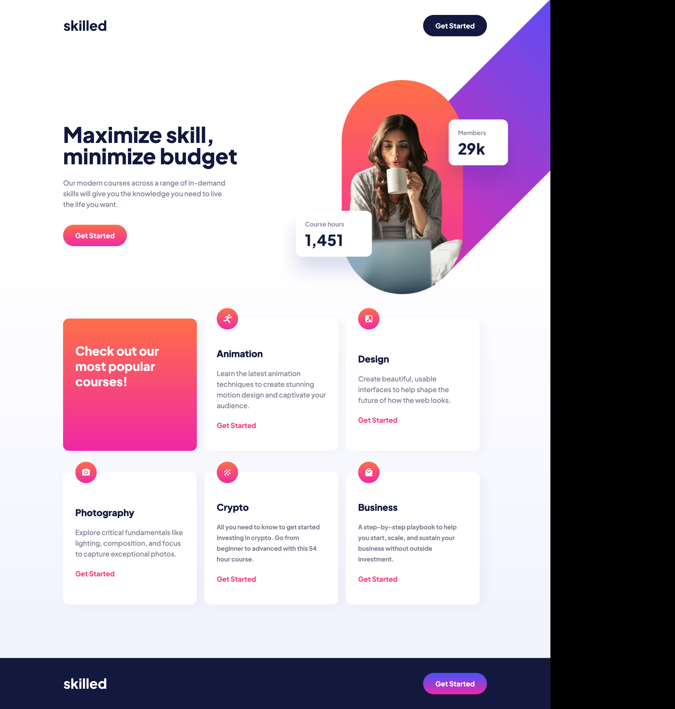
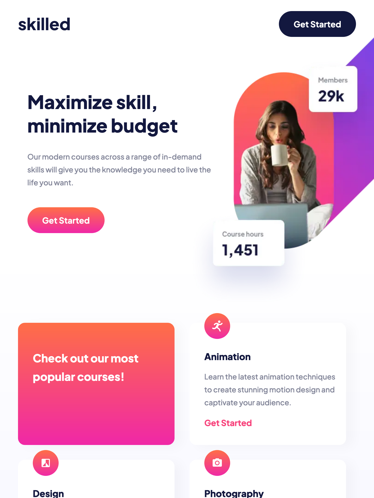
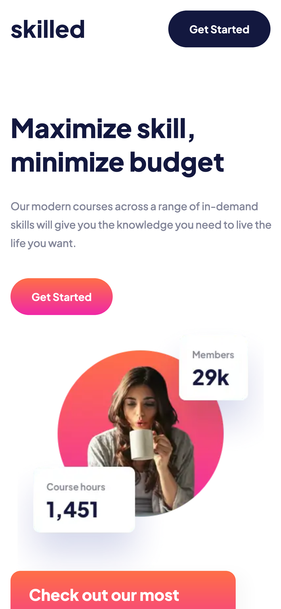

# Frontend Mentor - Skilled e-learning landing page solution

This is a solution to the [Skilled e-learning landing page challenge on Frontend Mentor](https://www.frontendmentor.io/challenges/skilled-elearning-landing-page-S1ObDrZ8q). Frontend Mentor challenges help you improve your coding skills by building realistic projects.

## Table of contents

- [Overview](#overview)
  - [The challenge](#the-challenge)
  - [Screenshot](#screenshot)
  - [Links](#links)
- [My process](#my-process)
  - [Built with](#built-with)
  - [What I learned](#what-i-learned)
- [Author](#author)

## Overview

### The challenge

Users should be able to:

- View the optimal layout depending on their device's screen size
- See hover states for interactive elements

### Screenshot

### Links

- Solution URL: [Add solution URL here](https://your-solution-url.com)
- Live Site URL: [Add live site URL here](https://your-live-site-url.com)

## My process

This time i tried what i found to be the most optimal way (so far).
I started setting up most of css variables and built the components first to match the layout, so when i started composing html
everything would be "pre-built" and the adjustments after that would be minimal.

That helped me a lot, i still had to change a few things here and there but overall increased the speed of process.

### Built with

- Semantic HTML5 markup
- CSS custom properties
- Flexbox
- CSS Grid

### What I learned

I mostly practiced my CSS Grid skills, image positioning (specially to let only the overflow-y on the top img) and responsivity.

## Author

- Website - [Matheus Tenório](https://www.matheustenorio.com)
- Frontend Mentor - [@im-voracity](https://www.frontendmentor.io/profile/im-voracity)
- Instagram - [@matt.tenorio](https://www.instagram.com/matt.tenorio)
- Twitter - [@mathtenorio_dev](https://www.twitter.com/mathtenorio_dev)
